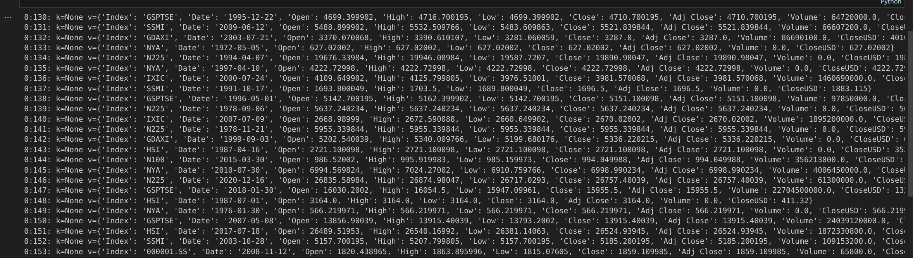

# Stock Market Kafka Real Time Data Engineering Project

## Introduction 
In this project, you will execute an End-To-End Data Engineering Project on Real-Time Stock Market Data using Kafka.

We are going to use different technologies such as Python, Amazon Web Services (AWS), Apache Kafka, Glue, Athena, and SQL.

## Architecture 

## Technology Used
- Programming Language - Python
- Amazon Web Service (AWS)
1. S3 (Simple Storage Service)
2. Athena
3. Glue Crawler
4. Glue Catalog
5. EC2
- Apache Kafka

## Dataset Used
You can use any dataset, we are mainly interested in operation side of Data Engineering (building data pipeline) 

Pre requisites :
- Get an AWS account
- Be able to connect to your EC2 instance from your local machine
- Create your own bucket (mine is not a variable and it should. So you need to change the bucket name into KafkaConsumer.ipynb)

Installation of Kafka is described in "command_kafka.txt"or "kafka-stock-market" and is not automated through docker (induce cost) or IAC

## Notes:

Part 1, 2, 3, 4 are not described in this project.  
But most important is how to interact with Kafka to S3 with the use of notebooks.  

Once Kafka is installed on your EC2 instance and started with Zookeeper, then you can from your local machine with the help of your jupiter notebooks feed kafka and send data to your S3 bucket.

Then from the consumer jupiter notebook you will get something like this:

Then once AWS Glue Crawler is configured, and the AWS Glue Catalog, you can query the table from Amazon Athena